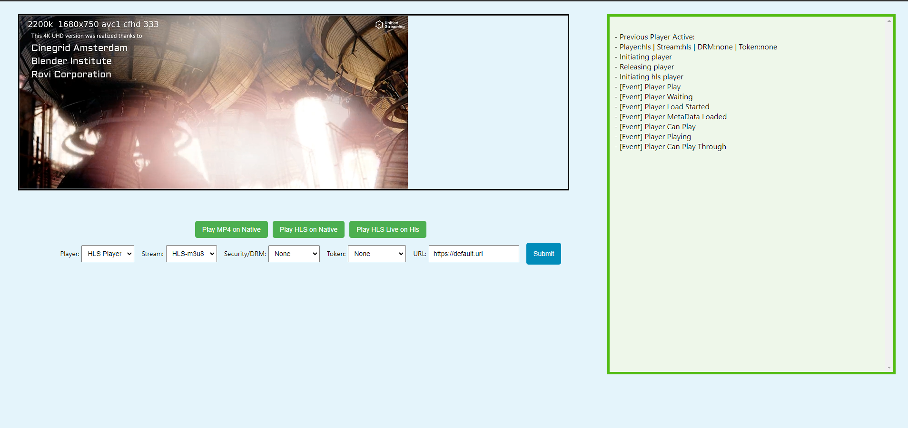

# React Stream Testing App

## Overview

The React Stream Testing App is a versatile tool that allows users to test various combinations of streaming protocols, players, DRM solutions, and tokens. Whether you're working with HLS, DASH, Shaka Player, native players, or different DRM providers, this app provides a convenient interface for testing and validating your streaming configurations.

Live Demo <a href="https://harshadaycsm.github.io/test-player/">Here</a>

</img>

## Features

- **Stream Protocols:**
  - HLS
  - DASH

- **Players:**
  - HLS.js
  - Shaka Player
  - Dash.js
  - Native HTML5 Video Player

- **DRM Solutions:**
  - Widevine
  - PlayReady

- **Token Support:**
  - AES128
  - CustomData

## Getting Started

### Prerequisites

Make sure you have the following installed:

- [Node.js](https://nodejs.org/)
- [npm](https://www.npmjs.com/) (Node Package Manager)

### Installation

1. Clone the repository:

   ```bash
   git clone https://github.com/harshadaYCSM/test-player.git

2. Run 
   ```bash
   npm install

3. Run 
   ```bash
   npm start

